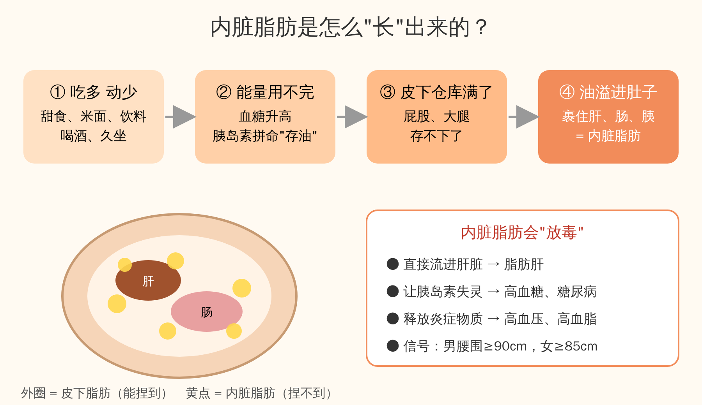

# 减内脏脂肪最快的方法 · 逐字稿

> 主题：内脏脂肪是怎么形成的，怎么最快减掉
> 时长：约 2 分钟（口播）

---

## 【开场】

你有没有发现，有的人四肢不胖，偏偏肚子圆滚滚、硬邦邦的？
这多半不是普通的肥肉，而是藏在肚子里面的——**内脏脂肪**。
今天用两分钟，讲清楚它是怎么来的，又怎么最快把它减下去。

## 【一、内脏脂肪是什么】

咱们身上的脂肪分两种。
一种在皮肤底下，用手能捏起来，叫**皮下脂肪**。
另一种藏在肚子里面，裹在肝、肠子、胰腺周围，手捏不到，这就是**内脏脂肪**。
肚子大、摸着硬，往往就是它在作怪。

## 【二、它是怎么形成的？一句话：仓库满了，油就溢进肚子】

打个比方，大家就明白了。

**第一步，吃多、动少。**
甜食、白米饭、面条、饮料、喝酒，吃进去的能量比一天用掉的多。

**第二步，能量用不完，身体就存起来。**
血糖一升高，胰岛素就出来"搬运"，把多余的糖变成油存进脂肪里。

**第三步，皮下这个"仓库"先存，存满了。**
屁股、大腿、胳膊这些地方，就是身体最先用的仓库。

**第四步，仓库满了，油就溢到肚子里。**
多出来的脂肪只能往腹腔里堆，裹住肝脏、肠子——这就是内脏脂肪。
所以你会看到：**有人看着不胖，体检却查出脂肪肝**，因为油全藏在里面。

另外，**喝酒、熬夜、压力大**会让身体分泌更多的"压力激素"，它特别喜欢把脂肪往肚子上赶。

## 【三、为什么一定要减】

内脏脂肪不是安安静静待着的，它会"放毒"：
- 它离肝脏最近，油直接流进肝里，**形成脂肪肝**；
- 它让胰岛素越来越不灵，**血糖升高，慢慢变成糖尿病**；
- 它还会释放炎症物质，**带来高血压、高血脂**。

一个简单的自测：**男性腰围超过 90 厘米，女性超过 85 厘米**，就要警惕了。

## 【四、减内脏脂肪最快的方法】

好消息是：**内脏脂肪比皮下脂肪更好减**，方法对了，几周就能看到腰围变化。记住四件事：

1. **先断糖、少精米白面。** 奶茶、饮料、甜点先停掉，主食一半换成粗粮杂豆。这是见效最快的一步。
2. **戒酒。** 酒精是脂肪肝的头号推手，减内脏脂肪必须先把酒放下。
3. **动起来：快走 + 力量。** 每天快走或慢跑 30 分钟，每周加 2～3 次深蹲、平板支撑。运动时身体会优先烧肚子里的油。
4. **睡够觉，少熬夜。** 每天睡 7 小时左右，压力激素降下来，肚子才不会越减越顽固。

## 【结尾】

总结一句话：
**内脏脂肪，是吃多动少、仓库装满后"溢"进肚子里的油。**
少吃糖、戒掉酒、动起来、睡好觉，腰围一小，脂肪肝、血糖、血压都会跟着变好。
收藏起来，从今天开始做。

---

*注：以上为健康科普，有脂肪肝、糖尿病等疾病的人，请在医生指导下调整饮食和用药。*
